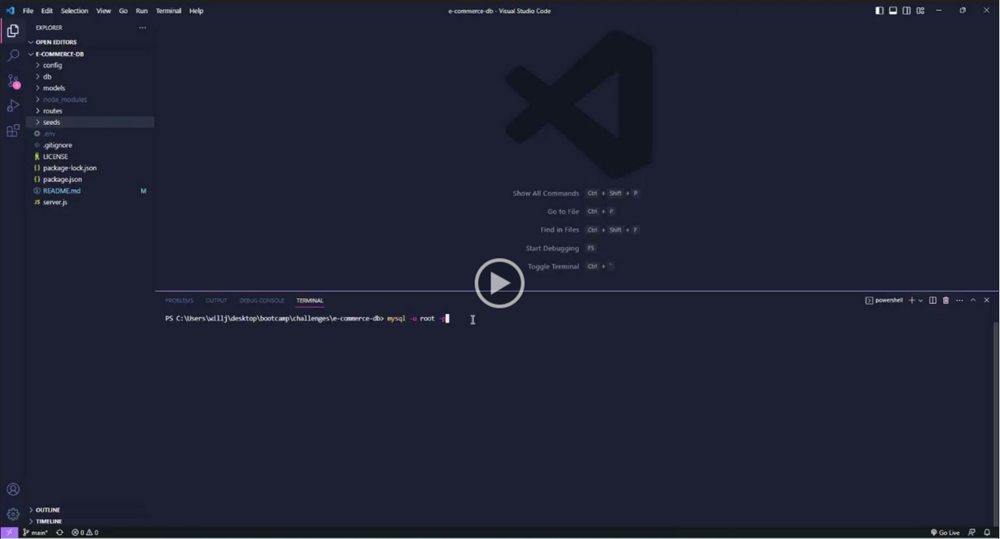

# e-commerce-db
  
  
 

  ## Description
  For this project, I have finished the starter code with proper routes and folder structure so that all products, tags and categories can be retrieved in bulk, by a single respective ID, updated, created, or deleted. 
  
  ## Table of Contents
  * [Description](#description)
  * [Installation](#installation)
  * [Usage](#usage)
  * [License](#license)
  * [Contribution](#contribution)
  * [Tests](#tests)
  * [Questions](#questions)
  

  ## Installation
  Run command npm install for this to work properly.
  
  ## Usage
  This database can be used to manage products, tags, and categories.

  Demonstration:

 

  ## License
  The license this project is under is MIT. For more information, please click the link below:

  https://opensource.org/licenses/MIT
  
  ## Contribution
  Feel free to add an issue to my repo or reach out to me on github.
  
  ## Tests
  Clone my project and install the necessary items and run npm start in your terminal.
  
  ## Questions
  Any Questions? You can email me at willjaramillo30@gmail.com
  Or, reach out to me on GitHub at https://github/willj30